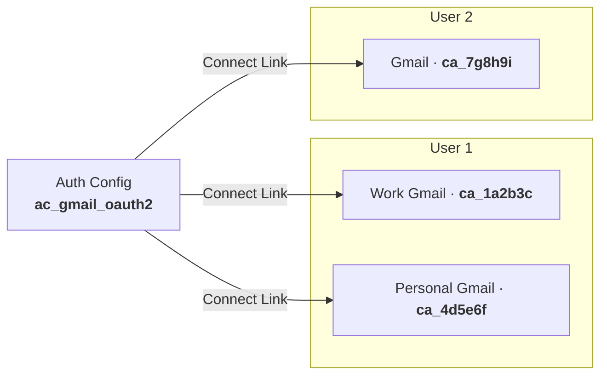
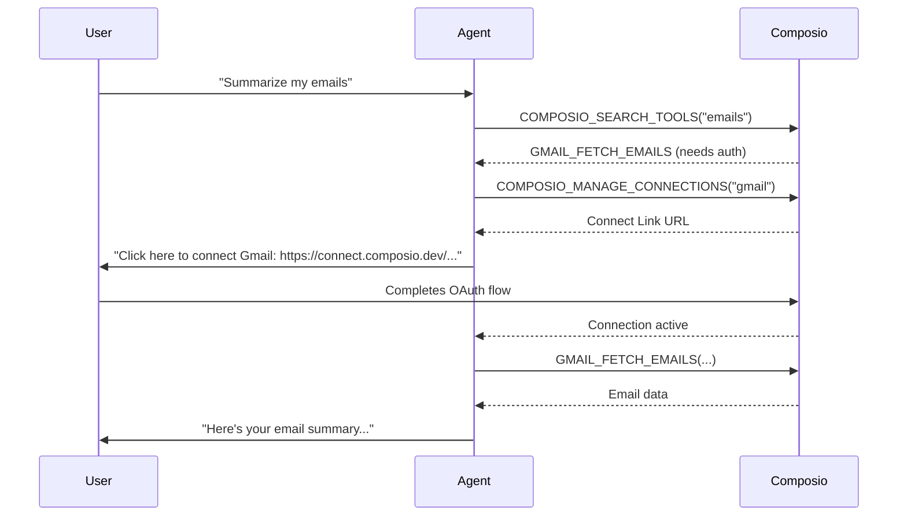

Composio handles authentication end-to-end. You define an **auth config** for each toolkit — or use Composio's managed defaults — and Composio generates a **Connect Link** that users follow to grant access. Once a user completes the flow, Composio creates a connected account, stores the credentials, and handles token refresh automatically. Your agent never touches raw tokens.



## Auth schemes

Composio supports four authentication schemes:

| Scheme | Description | Examples |
|---|---|---|
| `OAUTH2` | Three-legged OAuth 2.0. Composio handles the redirect, code exchange, and token refresh. | Gmail, GitHub, Slack, Notion |
| `API_KEY` | User provides a static API key. Stored securely and passed in request headers. | Linear, OpenAI, Pinecone |
| `BEARER_TOKEN` | A bearer token passed in the `Authorization` header. Similar to API key but typed as a Bearer scheme. | Some REST APIs |
| `BASIC` | Username and password sent with each request using HTTP Basic Auth. | Legacy APIs, self-hosted tools |

Composio auto-detects the correct scheme for each toolkit. You only need to think about schemes when creating custom auth configs.

## Managed auth (default)

Most toolkits work out of the box with **Composio managed auth**. Composio provides its own registered OAuth app credentials, so you can authenticate users immediately without setting up your own OAuth apps.

<Tabs items={["TypeScript", "Python"]}>
  <Tab value="TypeScript">
    ```typescript
    import { Composio } from '@composio/core';

    const composio = new Composio({ apiKey: process.env.COMPOSIO_API_KEY });

    // Composio auto-creates an auth config with its managed credentials
    const session = await composio.create("user_123");

    const connectionRequest = await session.authorize("github");
    console.log(connectionRequest.redirectUrl);
    // User visits this URL to connect their GitHub account
    ```
  </Tab>
  <Tab value="Python">
    ```python
    from composio import Composio

    composio = Composio(api_key="your_api_key")

    # Composio auto-creates an auth config with its managed credentials
    session = composio.create(user_id="user_123")

    connection_request = session.authorize("github")
    print(connection_request.redirect_url)
    # User visits this URL to connect their GitHub account
    ```
  </Tab>
</Tabs>

<Note>
  With managed auth, the OAuth consent screen shows Composio's branding. If you want your own app name and logo on the OAuth screen, use a custom auth config instead.
</Note>

## Custom auth configs

Create a custom auth config when you want to use your own OAuth app credentials — for white-labeling, custom scopes, or toolkits that require your own API registration.

<Tabs items={["TypeScript", "Python"]}>
  <Tab value="TypeScript">
    ```typescript
    import { Composio } from '@composio/core';

    const composio = new Composio({ apiKey: process.env.COMPOSIO_API_KEY });

    const authConfig = await composio.authConfigs.create("gmail", {
      type: "use_custom_auth",
      name: "My Gmail OAuth App",
      authScheme: "OAUTH2",
      credentials: {
        client_id: process.env.GOOGLE_CLIENT_ID,
        client_secret: process.env.GOOGLE_CLIENT_SECRET,
      },
    });

    console.log(authConfig.id); // "ac_abc123" — store this ID
    ```
  </Tab>
  <Tab value="Python">
    ```python
    import os
    from composio import Composio

    composio = Composio(api_key="your_api_key")

    auth_config = composio.auth_configs.create(
        "gmail",
        type="use_custom_auth",
        name="My Gmail OAuth App",
        auth_scheme="OAUTH2",
        credentials={
            "client_id": os.environ["GOOGLE_CLIENT_ID"],
            "client_secret": os.environ["GOOGLE_CLIENT_SECRET"],
        },
    )

    print(auth_config.id)  # "ac_abc123" — store this ID
    ```
  </Tab>
</Tabs>

For API key-based toolkits, pass the key in the credentials directly:

<Tabs items={["TypeScript", "Python"]}>
  <Tab value="TypeScript">
    ```typescript
    const authConfig = await composio.authConfigs.create("linear", {
      type: "use_custom_auth",
      name: "Linear API Key",
      authScheme: "API_KEY",
      credentials: {
        api_key: process.env.LINEAR_API_KEY,
      },
    });
    ```
  </Tab>
  <Tab value="Python">
    ```python
    auth_config = composio.auth_configs.create(
        "linear",
        type="use_custom_auth",
        name="Linear API Key",
        auth_scheme="API_KEY",
        credentials={
            "api_key": os.environ["LINEAR_API_KEY"],
        },
    )
    ```
  </Tab>
</Tabs>

Once you have an auth config ID, use it when creating sessions or initiating connections to ensure your credentials are used:

<Tabs items={["TypeScript", "Python"]}>
  <Tab value="TypeScript">
    ```typescript
    const session = await composio.create("user_123", {
      authConfigs: {
        gmail: "ac_abc123",
      },
    });
    ```
  </Tab>
  <Tab value="Python">
    ```python
    session = composio.create(
        user_id="user_123",
        auth_configs={"gmail": "ac_abc123"},
    )
    ```
  </Tab>
</Tabs>

You can also list, update, enable, and disable auth configs:

<Tabs items={["TypeScript", "Python"]}>
  <Tab value="TypeScript">
    ```typescript
    // List all auth configs for a toolkit
    const configs = await composio.authConfigs.list({ toolkit: "gmail" });

    // Get a specific config
    const config = await composio.authConfigs.get("ac_abc123");

    // Disable a config (prevents new connections, doesn't break existing ones)
    await composio.authConfigs.disable("ac_abc123");

    // Delete a config
    await composio.authConfigs.delete("ac_abc123");
    ```
  </Tab>
  <Tab value="Python">
    ```python
    # List all auth configs for a toolkit
    configs = composio.auth_configs.list(toolkit="gmail")

    # Get a specific config
    config = composio.auth_configs.get("ac_abc123")

    # Disable a config
    composio.auth_configs.disable("ac_abc123")

    # Delete a config
    composio.auth_configs.delete("ac_abc123")
    ```
  </Tab>
</Tabs>

## Connect Links

A Connect Link is a hosted page where users securely authenticate with a toolkit. Composio generates a unique link for each user-toolkit pair. The link handles the entire OAuth flow — redirect, code exchange, token storage — and then redirects back to your `callbackUrl`.

**Via session:**

<Tabs items={["TypeScript", "Python"]}>
  <Tab value="TypeScript">
    ```typescript
    const session = await composio.create("user_123");

    const connectionRequest = await session.authorize("github", {
      callbackUrl: "https://myapp.com/auth/callback",
    });

    console.log(connectionRequest.redirectUrl);
    // "https://connect.composio.dev/link/ln_abc123"

    // After the user visits the URL and authenticates:
    const connectedAccount = await connectionRequest.waitForConnection();
    console.log(connectedAccount.status); // "ACTIVE"
    ```
  </Tab>
  <Tab value="Python">
    ```python
    session = composio.create(user_id="user_123")

    connection_request = session.authorize(
        "github",
        callback_url="https://myapp.com/auth/callback",
    )

    print(connection_request.redirect_url)
    # "https://connect.composio.dev/link/ln_abc123"

    # After the user visits the URL and authenticates:
    connected_account = connection_request.wait_for_connection()
    print(connected_account.status)  # "ACTIVE"
    ```
  </Tab>
</Tabs>

**Via `connectedAccounts.link()` directly:**

<Tabs items={["TypeScript", "Python"]}>
  <Tab value="TypeScript">
    ```typescript
    const connectionRequest = await composio.connectedAccounts.link(
      "user_123",
      "ac_abc123",
      { callbackUrl: "https://myapp.com/auth/callback" }
    );

    const redirectUrl = connectionRequest.redirectUrl;
    ```
  </Tab>
  <Tab value="Python">
    ```python
    connection_request = composio.connected_accounts.link(
        user_id="user_123",
        auth_config_id="ac_abc123",
        callback_url="https://myapp.com/auth/callback",
    )

    redirect_url = connection_request.redirect_url
    ```
  </Tab>
</Tabs>

## In-chat authentication

When your agent needs a toolkit that the user hasn't connected yet, Composio's `COMPOSIO_MANAGE_CONNECTIONS` meta tool automatically generates a Connect Link and presents it in chat — no code required.



In-chat authentication is enabled by default in all sessions. The agent pauses, presents the link, and continues once the user confirms they've authenticated. No session configuration is needed.

<Tip>
  Use in-chat authentication for broad agents that connect different apps depending on user intent. Use `session.authorize()` for onboarding flows where you want users connected before they start chatting.
</Tip>

## When to use managed vs. custom auth

| Scenario | Recommendation |
|---|---|
| Getting started, prototyping | **Managed auth** — zero setup, works immediately |
| You want your brand on the OAuth consent screen | **Custom auth config** with your own OAuth app |
| You need specific OAuth scopes beyond Composio's defaults | **Custom auth config** with `scopes` override |
| The toolkit requires your own API registration (e.g., some enterprise apps) | **Custom auth config** |
| You have existing OAuth apps and connected users to migrate | **Custom auth config** — import your existing credentials |

<CardGroup cols={2}>
  <Card title="Connected Accounts" href="/concepts/connected-accounts">
    List, create, and manage per-user credentials
  </Card>
  <Card title="Sessions" href="/concepts/sessions">
    How sessions scope auth to a single user
  </Card>
  <Card title="Authenticating Users Guide" href="/guides/authenticating-users">
    Step-by-step onboarding flow with Connect Links
  </Card>
  <Card title="TypeScript Reference" href="/reference/ts/composio">
    Full API reference for authConfigs and connectedAccounts
  </Card>
</CardGroup>
