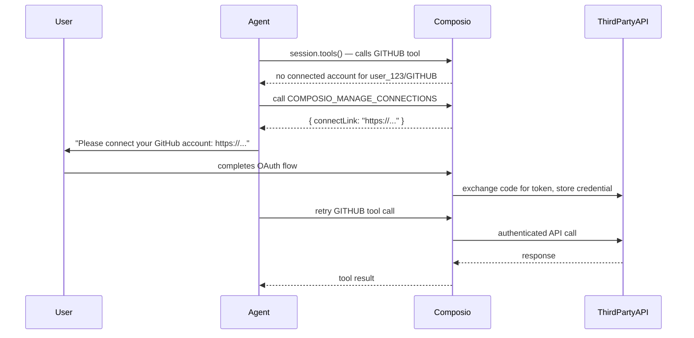
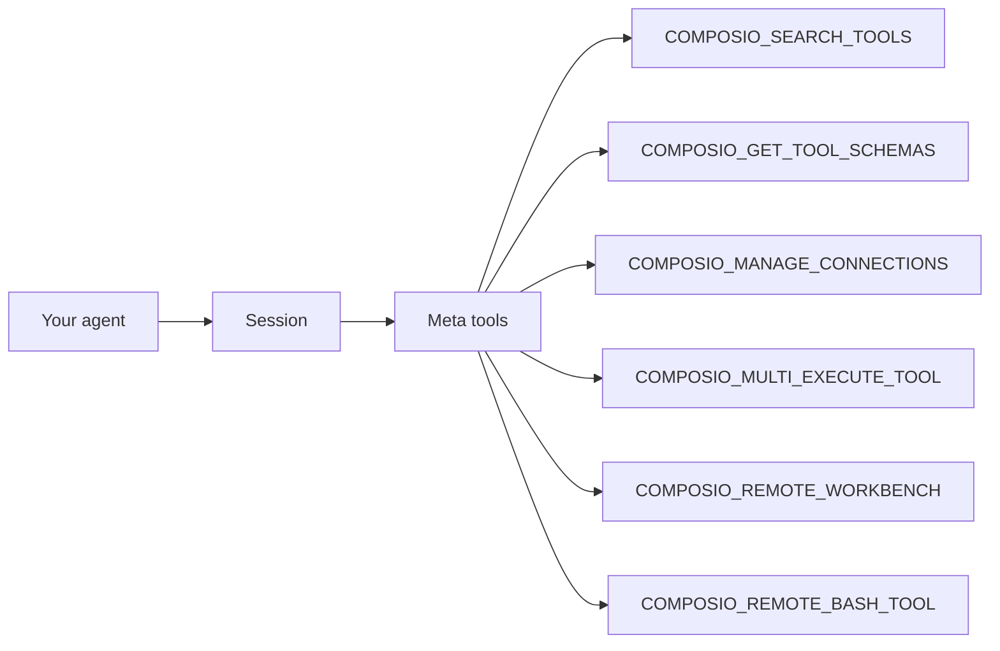

Composio is built around sessions. A session bundles a user identity, tool access, authentication state, and an MCP endpoint into a single runtime context. When your agent works on behalf of a user, it operates inside a session — every tool call, connected account lookup, and workbench operation is scoped to that session. This keeps data isolated between users and gives your agent a consistent, stateful environment for an entire task.

## Sessions

Call `composio.create(userId)` to get a session. The session exposes tools for framework-native tool calling and an MCP URL for MCP-compatible clients — both point at the same underlying context.

<Tabs>
<Tab title="TypeScript">
```typescript
import { Composio } from '@composio/core';

const composio = new Composio({ apiKey: process.env.COMPOSIO_API_KEY });

// Create a new session scoped to a user
const session = await composio.create('user_123');

// Option 1: get provider-wrapped tools for your AI framework
const tools = await session.tools();

// Option 2: get the MCP endpoint for MCP-compatible clients
const mcpUrl = session.mcp.url;

console.log('Session ID:', session.sessionId);
console.log('MCP URL:', mcpUrl);
```
</Tab>
<Tab title="Python">
```python
import os
from composio import Composio

composio = Composio(api_key=os.environ['COMPOSIO_API_KEY'])

# Create a new session scoped to a user
session = composio.create(user_id='user_123')

# Option 1: get provider-wrapped tools for your AI framework
tools = session.tools()

# Option 2: get the MCP endpoint for MCP-compatible clients
mcp_url = session.mcp.url

print('Session ID:', session.session_id)
print('MCP URL:', mcp_url)
```
</Tab>
</Tabs>

A session ties together:

- **User ID** — which user's connected accounts and tool executions are in scope.
- **Tool access** — all toolkits by default, or a filtered set of toolkits, tools, or tags.
- **Authentication** — managed OAuth, custom auth configs, and connected account selection.
- **Execution state** — logs, tool memory, MCP state, and workbench files for the task.

For multi-turn conversations, store the session ID and reuse the session with `composio.use()` rather than creating a new one each turn.

<Tabs>
<Tab title="TypeScript">
```typescript
import { Composio } from '@composio/core';

const composio = new Composio({ apiKey: process.env.COMPOSIO_API_KEY });

// Reuse an existing session by ID
const session = await composio.use('ses_abc123');
const tools = await session.tools();
```
</Tab>
<Tab title="Python">
```python
import os
from composio import Composio

composio = Composio(api_key=os.environ['COMPOSIO_API_KEY'])

# Reuse an existing session by ID
session = composio.use('ses_abc123')
tools = session.tools()
```
</Tab>
</Tabs>

<Note>
  Use a stable user ID such as a database UUID or primary key. Avoid email addresses (they can change) and never use `"default"` in production — it exposes all users' data under a single identity.
</Note>

## Tools and toolkits

A **toolkit** is a collection of related tools for a single third-party service (for example, `GITHUB` contains tools like `GITHUB_GET_REPO`, `GITHUB_CREATE_ISSUE`, and dozens more). A **tool** is one individual action with a typed input and output schema.

When you call `session.tools()`, Composio returns all tools the session has access to, wrapped in the format your AI framework expects. You can filter by toolkit to keep the tool list focused.

<Tabs>
<Tab title="TypeScript">
```typescript
import { Composio } from '@composio/core';

const composio = new Composio({ apiKey: process.env.COMPOSIO_API_KEY });
const session = await composio.create('user_123');

// All tools in scope for this session
const allTools = await session.tools();

// Filter to a specific toolkit
const githubTools = await session.tools({ toolkits: ['GITHUB'] });

// Filter to specific named tools
const specificTools = await session.tools({
  tools: ['GITHUB_GET_REPO', 'GITHUB_CREATE_ISSUE'],
});
```
</Tab>
<Tab title="Python">
```python
import os
from composio import Composio

composio = Composio(api_key=os.environ['COMPOSIO_API_KEY'])
session = composio.create(user_id='user_123')

# All tools in scope for this session
all_tools = session.tools()

# Filter to a specific toolkit
github_tools = session.tools(toolkits=['GITHUB'])

# Filter to specific named tools
specific_tools = session.tools(
    tools=['GITHUB_GET_REPO', 'GITHUB_CREATE_ISSUE']
)
```
</Tab>
</Tabs>

<Tip>
  You can also use `composio.tools.get(userId, { toolkits: ['GITHUB'] })` to fetch tools without creating a full session. See [Direct tool access](#direct-tool-access) below.
</Tip>

## Authentication

Composio manages OAuth 2.0, API key, and custom authentication flows for every toolkit. A **connected account** is a stored, refreshable credential for one user + one toolkit combination. An **auth config** is the OAuth application configuration (client ID, secret, scopes) that governs how connections are established.

When a user has already connected a toolkit, Composio uses their stored credential automatically. When they haven't, your agent can trigger the connection flow at runtime without any extra code.

### The connection flow

The `COMPOSIO_MANAGE_CONNECTIONS` meta tool (injected into every session) lets agents detect missing connections and surface a connect link to the user mid-conversation.



You can also trigger the connection flow explicitly with `session.authorize()`:

<Tabs>
<Tab title="TypeScript">
```typescript
import { Composio } from '@composio/core';

const composio = new Composio({ apiKey: process.env.COMPOSIO_API_KEY });
const session = await composio.create('user_123');

// Programmatically initiate OAuth for a toolkit
const connectionRequest = await session.authorize('github');

if (connectionRequest.redirectUrl) {
  console.log('Send user to:', connectionRequest.redirectUrl);
}
```
</Tab>
<Tab title="Python">
```python
import os
from composio import Composio

composio = Composio(api_key=os.environ['COMPOSIO_API_KEY'])
session = composio.create(user_id='user_123')

# Programmatically initiate OAuth for a toolkit
connection_request = session.authorize('github')

if connection_request.redirect_url:
    print('Send user to:', connection_request.redirect_url)
```
</Tab>
</Tabs>

Once a user connects a toolkit, the connected account persists under their user ID and is reused automatically by all future sessions — no re-authentication required.

## Meta tools

Every session includes a set of built-in **meta tools** that are injected automatically. These tools let the agent discover, authenticate, and execute other tools at runtime instead of loading hundreds of tool schemas into context up front.

| Meta tool | What it does |
|---|---|
| `COMPOSIO_SEARCH_TOOLS` | Search for tools by name or description across all available toolkits |
| `COMPOSIO_GET_TOOL_SCHEMAS` | Fetch the full input/output schema for one or more specific tools |
| `COMPOSIO_MANAGE_CONNECTIONS` | Check connection status for a toolkit and get a connect link if needed |
| `COMPOSIO_MULTI_EXECUTE_TOOL` | Execute multiple tools in a single call for bulk operations |
| `COMPOSIO_REMOTE_WORKBENCH` | Interact with the per-session sandboxed Python workbench |
| `COMPOSIO_REMOTE_BASH_TOOL` | Run bash commands inside the session's remote workbench environment |

<Note>
  Meta tool calls share context through the session. An agent can search for tools in one turn and execute them in the next without losing state — the session keeps everything connected.
</Note>

The typical flow for a session that uses meta tools looks like this:



## Direct tool access

Sessions are the recommended way to work with Composio, but you can also access tools and execute them directly on the `Composio` instance without creating a session. This is useful for simple scripts, one-off tool calls, or when you don't need per-user session state.

<Tabs>
<Tab title="TypeScript">
```typescript
import { Composio } from '@composio/core';

const composio = new Composio({ apiKey: process.env.COMPOSIO_API_KEY });

// Fetch tools without a session
const tools = await composio.tools.get('user@example.com', {
  toolkits: ['HACKERNEWS'],
});

// Execute a tool directly
const result = await composio.tools.execute('HACKERNEWS_GET_USER', {
  userId: 'user@example.com',
  arguments: { username: 'pg' },
});

console.log(result.data);
```
</Tab>
<Tab title="Python">
```python
import os
from composio import Composio

composio = Composio(api_key=os.environ['COMPOSIO_API_KEY'])

# Fetch tools without a session
tools = composio.tools.get(
    user_id='user@example.com',
    toolkits=['HACKERNEWS'],
)

# Execute a tool directly
result = composio.tools.execute(
    user_id='user@example.com',
    slug='HACKERNEWS_GET_USER',
    arguments={'username': 'pg'},
)

print(result)
```
</Tab>
</Tabs>

<Note>
  Direct tool access does not include meta tools, workbench state, or session-scoped auth management. For production agents that work on behalf of real users, use sessions via `composio.create()`.
</Note>
